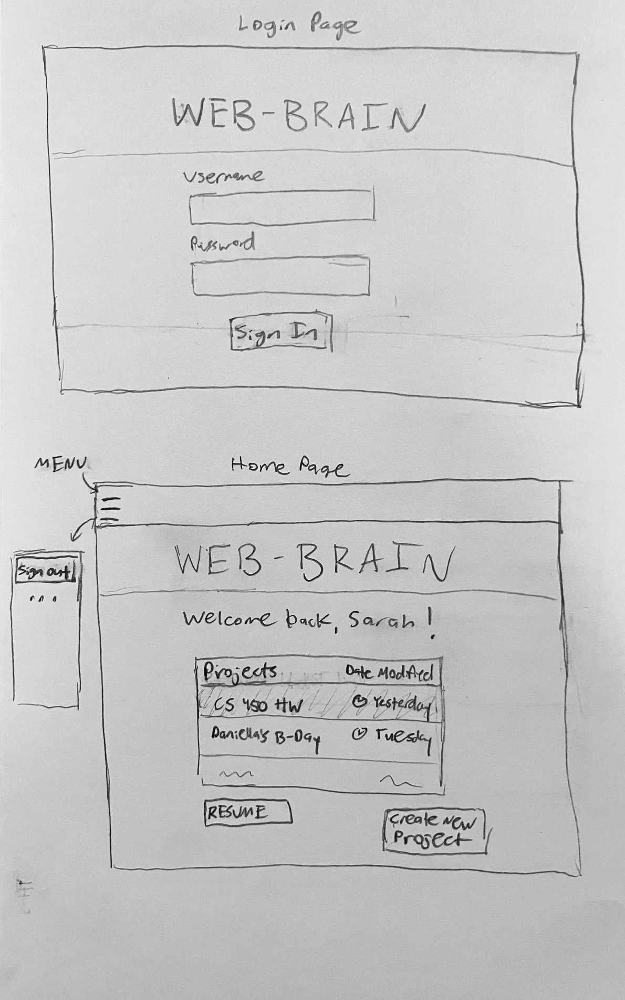
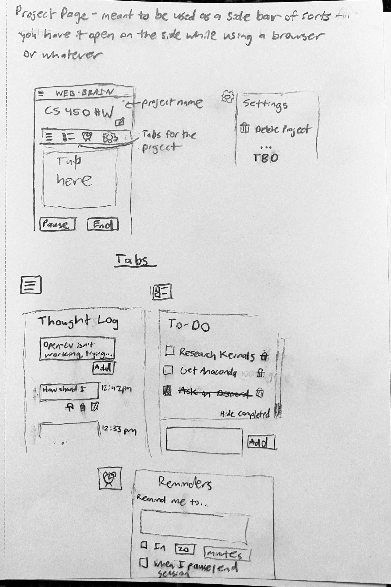

# startup

## Elevator Pitch
Our brains have too many things to keep track of. Mix in ADHD, executive functioning problems, or working memory deficits, and it's just plain hard! Enter Web-Brain, a place to put your thoughts mid-project so your mind has room to thrive. Web-Brain has nifty spots to thought dump, make a to-do list, and set reminders! Organize by project and switch between them whenever the mood strikes you. Let Web-Brain keep track of the details and go wild!

## Description of Key Features
### Account
Users can create an account to store and access their projects.
### Welcome Page
The user can choose a project to resume or start a new one. The next upcoming major U.S. holiday will be displayed on this page (either for motivation or as a reminder).
### Projects
#### Thought Log
Record your thoughts in text chain style entries that can be edited or deleted. This is a way to keep track of your thought process, mind dump, rubber duck, etc.
#### To-Do List
A standard, simple to-do list. Keep track of tasks on the fly without navigating to another website (and maybe getting distracted in the process).
#### Reminders
Nudge yourself to do tasks after a certain amount of time, or when you pause/end your work session. This can also be used for a pomodoro timer.
### Key Feature List:
- Secure login (over HTTPS)
- Ability to create, modify, and delete projects
- Ability to log and edit text entries in the Thought Log
- Ability to add, edit, mark complete, and delete items in the To-Do List
- Ability to add, edit, and delete reminders in the Reminder Tab
- The website displays or gives notifications for the reminders the user creates
- Projects are stored persistently

## Representation of All Technologies
- **HTML** - The structure of the webpages, such as the login, welcome, and project pages
- **CSS** - Application styling on all pages to make the layout aesthetically pleasing and easy to navigate
- **JavaScript** - Provides the interactive elements of the pages, such as the add, edit, and delete buttons
- **Service** - There will be web service endpoints for login, retrieving projects from the database, etc.
- **Database/Login** - Login credentials and users' projects are stored securely stored in a database
- **Authentication** - The user will be authenticated with login credientials, and can only see/modify projects while logged in
- **WebSocket** - Pushes notifications about reminders the user created
- **React** - The startup will be ported to React
- **External API** - The welcome page will display the next upcoming U.S. holiday, which will be fetched from an external API

## Sketches

## HTML Deliverable
- **Application Data** - demonstrated by the placeholder for the username, user projects, the 3rd party API call to get the next upcoming holiday (displayed on the home screen), etc.
- **Authentication** - placeholders for the user's username and password on a login page
- **Database Data** - demonstrated by placeholders for the user's projects, thought logs, to-do lists, reminders, and username displays
- **WebSocket Data** - an alert shown on the reminders page, as a placeholder for a notification when a reminder comes up. Also, the time you've been working (and the motivational phrase) on the bottom of the thought log, to-do list, and reminder pages that will update periodically
- **Note** - images are too distracting for ADHD people like myself, so my application will not have any images. This is a feature, not a bug.

## CSS Deliverable
- [x] done - Prerequisite: Simon CSS deployed
- [x] done - Prerequisite: Link to Github on home page
- [x] done - Prerequisite: Notes in startup Git repository README.md file
- [x] partially done - 30% Header, footer, and main content body. For the life of me can't figure out why it won't fill up the page...but I did use flex layout
- [x] - done - 20% Navigation elements. Buttons or links to move around
- [x] done - 10% Mostly responsive to window resizing. Thank you, Bootstrap.
- [x] done - 20% Application elements. Bootstrap accordian for the project page.
- [x] done - 10% Application text content. Text is displayed using Lexend font
- [x] done - 10% Application images. I added Bootstrap icons. I won't be using any other images because it's too distracting for us ADHDers.

**Notes**
- My commits are inconsistent because my focus was on another CS lab for the first while
- This application is meant to be used as a sidebar, not at full monitor width
- The css is intentionally minimalist and not attention grabbing. Us ADHDers get distracted very easily by shiny formatting.
- I still haven't figured out how to make the accordian bodies to collapse correctly. It's not my accordian specifically; even when I copy and paste the demos, it doesn't work...hopefully I'll get to the bottom of this eventually
- I redid a lot of the html design while doing the css

[Link to notes page](notes.md)
